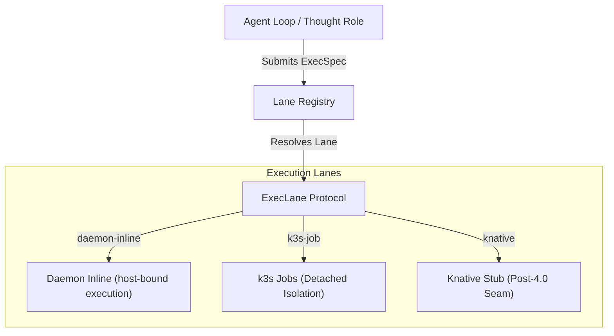

# Execution Lane Contract

This document specifies the execution-lane interface contract for Agentos. This seam allows the Agentos runtime to decouple capability execution from the underlying infrastructure, facilitating detached execution on k3s Jobs + NATS + Daemon today, and enabling Knative (or other FaaS engines) to drop in later with zero runtime code changes.

The canonical contract text lives in this repo. The Python implementation lives in the sibling inference-engine package at `../inference-engine/python-agent/agent/exec_lane/` (specifically `contract.py`) and should use typed Python stdlib only.

---

## 1. Architectural Role

As outlined in the capability plan, capability execution is split into two primary paths. The execution-lane contract abstracts this division, presenting a single interface to the agent loop and worker lifecycle controllers.



---

## 2. Lane-Selection Rules

Every capability/tool declared in the registry carries an `exec_lane` hint and runtime parameter constraints. Selecting the correct lane depends on the latency, isolation, and scaling requirements:

| Lane Name | Identifier | Isolation Level | Scaling Behavior | Use Cases |
| :--- | :--- | :--- | :--- | :--- |
| **Daemon Inline** | `"daemon-inline"` | `host` (process-bound) | Local node execution, no scaling | Hot-loop filesystem access, fast tool invocation (e.g. read/edit), shell commands requiring zero cold start. |
| **k3s Job** | `"k3s-job"` | `container` (isolated) | Scales out via Kubernetes Jobs | Long-running tasks, heavy compiler/sandbox runs, parallel jobs, untrusted code execution. |
| **Knative (Reserved)** | `"knative"` | `sandbox` / `container` | Scale-to-zero micro-VMs / pods | Post-4.0 serverless capability bodies, high-concurrency eventing capabilities. |

### Rule Logic
1. **Default Inline Selection**: When `lane` is `inline` or isolation is `host`, the runtime directs execution to `"daemon-inline"`. This executes via the host-bound daemon process, minimizing overhead.
2. **Default Detached Selection**: When `lane` is `detached` or isolation is `container`, the runtime targets `"k3s-job"`. This encapsulates execution in a newly scheduled Kubernetes Job, ensuring resource bounds and network segregation.

---

## 3. The Contract Interface

### Data Structures

#### `ExecSpec`
The execution specification containing the instructions, container runtime directives, and target parameters.

```python
@dataclass(frozen=True)
class ExecSpec:
    command: list[str] | None = None
    image: str | None = None
    args: list[str] | None = None
    env: dict[str, str] = field(default_factory=dict)
    mounts: list[str] = field(default_factory=list)
    working_dir: str | None = None
    timeout: float | None = None
    resource_hints: dict[str, str] = field(default_factory=dict)
    lane: Literal["inline", "detached"] | None = None
    isolation_level: Literal["host", "container", "sandbox"] | None = None
```

> [!IMPORTANT]
> The `env` dictionary **must not** contain raw secrets. It should only contain references to secrets managed by the credential store (e.g. `"secret:GITHUB_TOKEN"`). These are resolved and injected securely at the execution boundary by the executing service (e.g. the daemon or k3s job injector).

#### `ExecHandle`
A tracking token returned upon successful task submission.

```python
@dataclass(frozen=True)
class ExecHandle:
    id: str
    lane: str
    submitted_at: datetime
```

#### `ExecStatus`
The current execution status block of the run, providing status, codes, and lifecycle timestamps.

```python
@dataclass(frozen=True)
class ExecStatus:
    status: Literal["queued", "running", "succeeded", "failed", "cancelled"]
    exit_code: int | None = None
    error_message: str | None = None
    finished_at: datetime | None = None
```

---

## 4. The ExecLane Protocol

Any execution engine must implement the `ExecLane` protocol structurally:

```python
@runtime_checkable
class ExecLane(Protocol):
    def submit(self, spec: ExecSpec) -> ExecHandle: ...
    def status(self, handle: ExecHandle) -> ExecStatus: ...
    def logs(self, handle: ExecHandle) -> Iterator[str]: ...
    def cancel(self, handle: ExecHandle) -> None: ...
    def capabilities(self) -> dict[str, Any]: ...
```

---

## 5. The Knative Drop-In Seam

To support Knative integration in the future without modifying core business logic, a reserved stub lane named `KnativeExecLane` is registered by default.

### Implementation Stub
```python
class KnativeExecLane(ExecLane):
    def submit(self, spec: ExecSpec) -> ExecHandle:
        raise NotImplementedError("Knative execution lane is reserved for post-4.0.")
    # (Other methods similarly raise NotImplementedError)
```

### Transitioning to Knative Post-4.0
When Knative support is introduced (D-028: 4.0 detached lane = k3s Jobs + NATS + daemon; Knative drops in post-4.0 behind the exec_lane contract):
1. Write the concrete Knative controller client that implements `ExecLane`.
2. Register the implementation under the reserved key `"knative"` using:
   ```python
   register_lane(LANE_KNATIVE, KnativeConcreteLane(...))
   ```
   The runtime resolves the lane using `get_lane("knative")` and schedules tasks onto Knative Services instead of k3s Jobs. No config toggle or routing override is required — the seam is a registry swap only.
